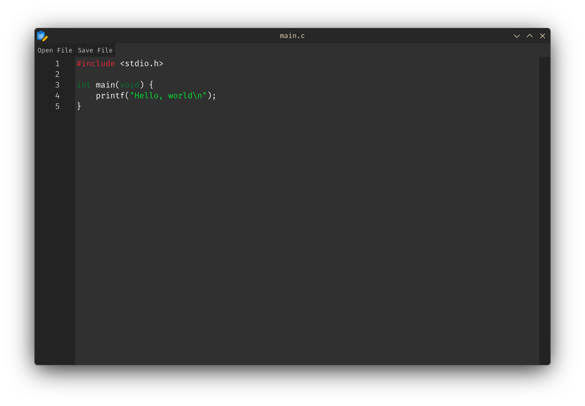
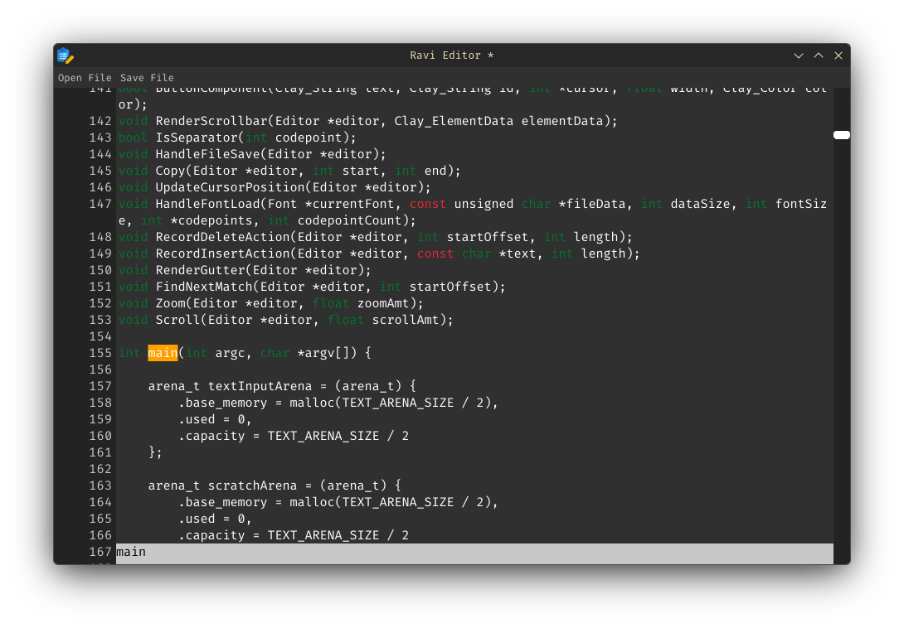
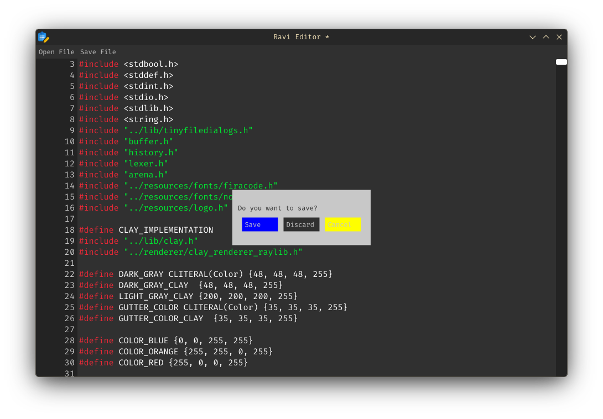

# Text editor made for fun

## About The Project
I always wanted to explore what it would be like to create text editor from scratch, so I finally decided to do it. It is not, by any means, a fully fledged editor. Just made for fun to see if I could do it or not and learn more about C.

### Built With
For this project I tried to use very few external libraries. They are:

- [raylib](https://github.com/raysan5/raylib) for gui
- [clay](https://github.com/nicbarker/clay) ui library to create simple layout
- clay's own [renderer](https://github.com/nicbarker/clay/tree/main/renderers/raylib) for raylib
- [tinyfiledialogs](https://github.com/native-toolkit/libtinyfiledialogs) to create dialog menus for saving and opening files

### Current Features

- Gutter line numbers 
- Blinking cursor
- Move cursor with arrows
- Jump cursor through text with `Ctrl` + `Arrow Key` combo
- Copy, paste, cut with `Ctrl` + `C`, `Ctrl` + `V`, `Ctrl` + `X` respectively
- Highlight all text with `Ctrl` + `A`
- Highlight words with `Ctrl` + `Shift` + `Arrow Key` combo
- Highlight text with mouse
- Scroll + scrollbar
- Simple syntax highlighting for basic keywords (int, void, char, long, float, etc.)
- Open file with `Ctrl` + `O` combo, drag and drop or through open file dialog
- Save file with `Ctrl` + `S` combo or through save file dialog
- Window title shows unsaved state and file name if opened
- Ability to detect if opened file was changed externally and reload it
- Supports zoom in and out with `Ctrl` + `Mouse Scroll` combo
- Supports undo/redo using `Ctrl` + `Z` and `Ctrl` + `Y`
- Searching functionality - `Ctrl` + `F` triggers search bar, from which you can search in editor
- If you have unsaved changes and try to close editor, popup prompt will appear to ask you to save, discard or cancel

